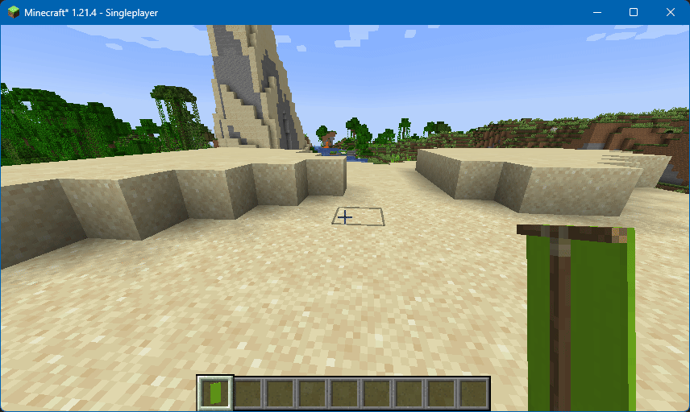

# Banner Writer

Adds a command to easily write text on banners, in a survival-friendly manner.

<figure><figcaption>
Writing text easily on banners.
</figcaption></figure>

## Usage

Use the command `/bannerWriter <text>`. Not all characters are supported; any unsupported will be listed in chat.

By default this does not require operator permission, though this can be changed.

## Configuration

### Enabled

Whether this feature should be enabled or not.

* Options: `true`, `false`
* Default: `true`

### Requires Operator

Whether the banner writer requires players have operator permissions.

* Options: `true`, `false`
* Default: `false`
