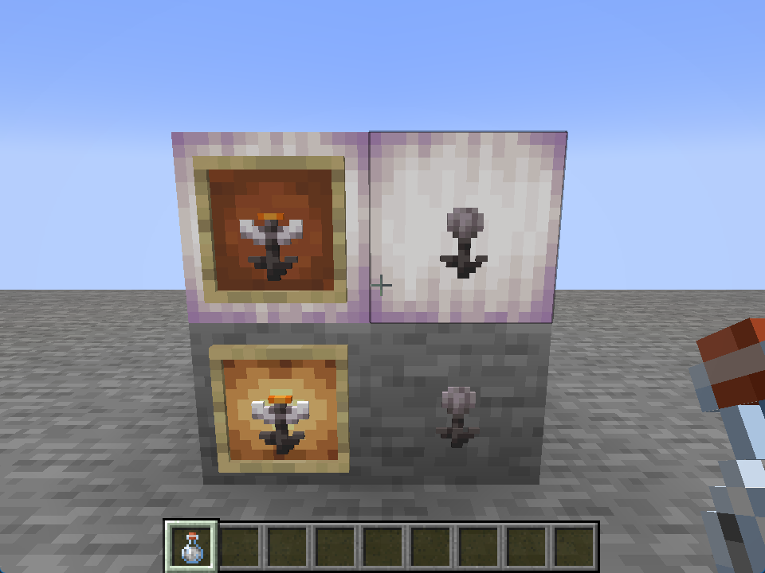
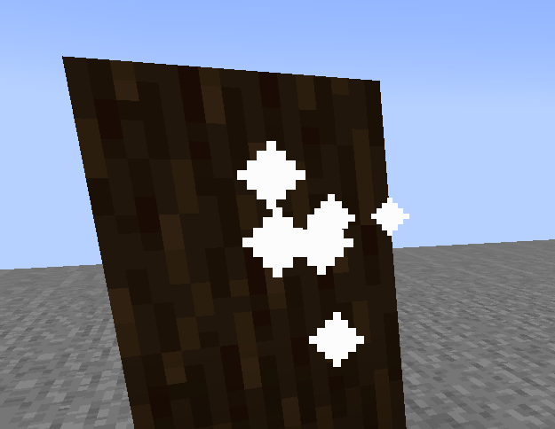

# Concealable Item Frames

**JSST** adds the ability for players to toggle the invisibility of item frames, by right clicking with any potion of invisibility.

<figure><figcaption>
An example of an Item Frame and Glowing Item Frame being invisible.
</figcaption></figure>

## Configuration

### Enabled

Whether this feature should be enabled or not.

* Options: `true`, `false`
* Default: `true`

### Show Empty Particles

<figure><figcaption>
Example of the empty particles
</figcaption></figure>

Whether to occasionally show particles where there are empty and invisible item frames.

* Options: `true`, `false`
* Default: `true`
