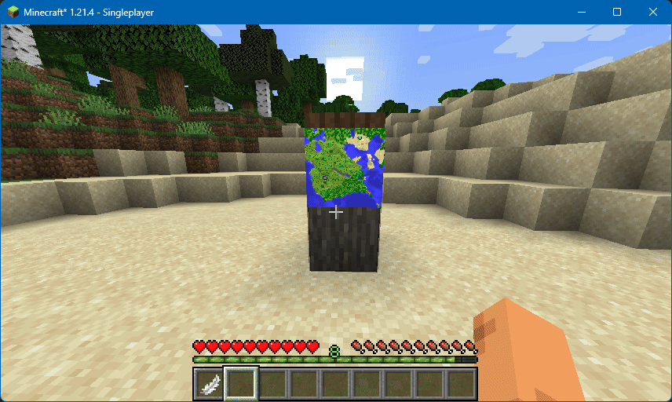

# Map Editor

**JSST** adds a survival-friendly map decoration editor, giving players the ability to mark maps with several icons, rotate them, and add labels.

<figure><figcaption>
A player editing a map in survival, adding, renaming and removing markers.
</figcaption></figure>

## Usage

Place a map in an item frame, then right click with a feather to start editing. Right click on a blank area to select an existing marking or add a new one.

* Name tag: add, update or remove a label
* Arrows: change icon
* Barrier: remove icon
* Swords: rotate icon

Left click to deselect the current icon; left click again to finish editing.

## Configuration

### Enabled

Whether this feature should be enabled or not.

* Options: `true`, `false`
* Default: `true`

### Requires Operator

Whether the map editor requires players have operator permissions.

* Options: `true`, `false`
* Default: `false`

### Edit Tool

Item or item tag used to start editing maps with.

* Options: an item ID (`minecraft:feather`) or item tag (`#c:dyes`).
* Default: `minecraft:feather`

### Disable Serialization

By default, Minecraft does not keep map markers on save / load. **JSST** slightly changes map serialization to allow this; this option is intended to be a debug option to disable this.

* Options: `true`, `false`
* Default: `false`
