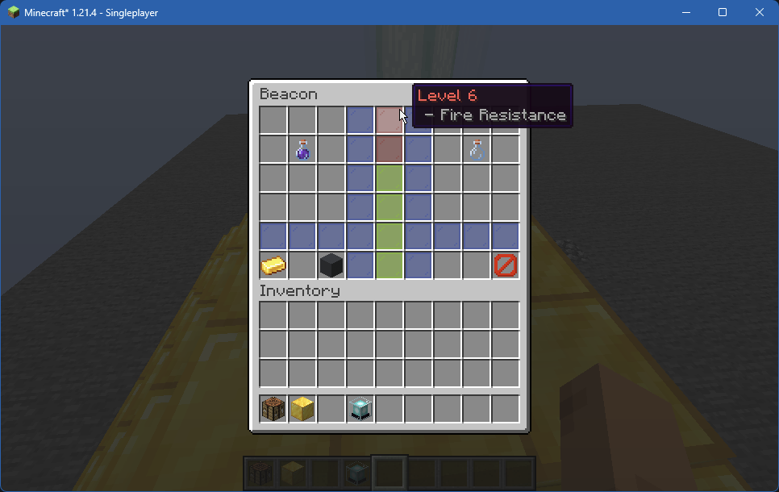

# Beacon Enhancement

**JSST** allows you to fully customize a beacon's power set, secondary power threshold and maximum level up to 6.

<figure><figcaption>
Example of the custom GUI used to support this - all functionality is the same.
</figcaption></figure>

## Configuration


A full list of vanilla effects and their ID's are available [here](https://minecraft.wiki/w/Effect#List).



Invalid mob effect IDs will be silently ignored - make sure to check if all are present when changing values.


### Enabled

Whether this feature should be enabled or not.

* Options: `true`, `false`
* Default: `false`

### [Beacon Range Modifier](effector-ranges.md)

Multiplier for the maximum range of an active beacon.

* Options: `[50%, 500%]`
* Default: `150%`

### Maximum Beacon Level

The maximum amount of levels that beacons are allowed to be.

* Options: `[1, 6]`
* Default: `6` (454 base blocks)

### Enable Secondary Power

Whether beacons should have a secondary power set.

* Options: `true`, `false`
* Default: `true`

### Secondary Power Level

The level that beacons need to be in order to grant a secondary power, or a higher level of the first power.

* Options: `[1, 6]`
* Default: `4`

### Primary Powers

A set of effect IDs for each level, which will available to beacons at or above the given level.

* Options: A set of effect IDs, in the form `minecraft:haste`.
* Default:
  * Level 1: `[speed, haste]`
  * Level 2: `[resistance, jump_boost]`
  * Level 3: `[strength]`
  * Level 4: `[glowing]`

### Secondary Powers

A set of effect IDs for each level, which will available to beacons above the **secondary level threshold** and at or above the given level. If a primary power is selected, that power will also be available to grant a stronger version.

* Options: A set of effect IDs, in the form `minecraft:haste`.
* Default:
  * Level 4: `[regeneration]`
  * Level 5: `[night_vision]`
  * Level 6: `[fire_resistance]`
