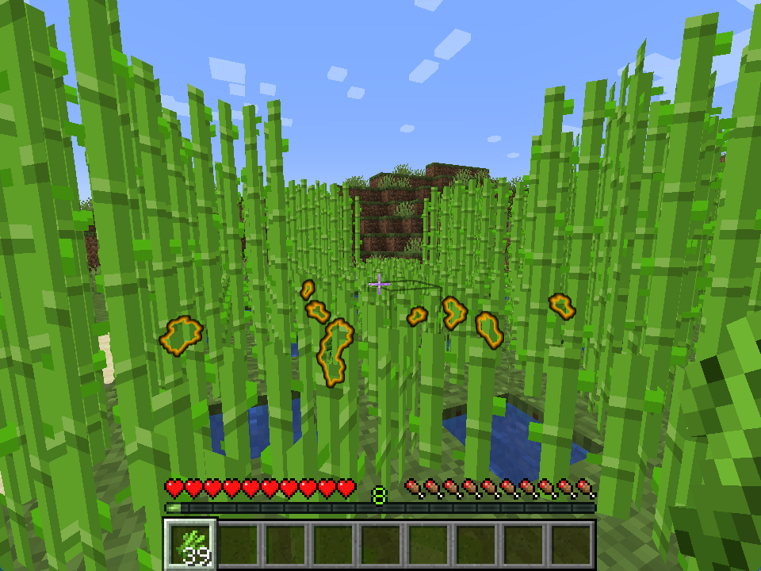
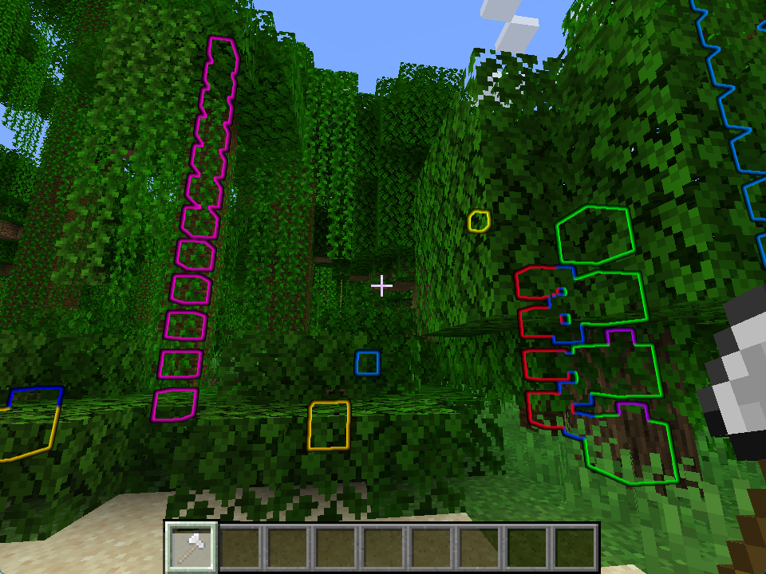

# Extra Highlights

**JSST** adds two quick highlighting features for sugarcane and tree logs.

## Sugarcane

When holding sugarcane, players will be able to see nearby sugarcane items on the ground - helpful for dense farms.

<figure><figcaption>
Sugarcane items, normally hidden behind blocks, being highlighted.
</figcaption></figure>

## Tree Logs

Players can sneak-right click with an axe to highlight nearby logs - helpful for jungle, acacia or other situations where they might be covered by foliage.

<figure><figcaption>
Logs being highlighted through foliage.
</figcaption></figure>

## Configuration

### Sugarcane Enabled

Whether dropped sugarcane should be highlighted when holding the item.

* Options: `true`, `false`
* Default: `true`

### Tree Logs Enabled

Whether players should be able to highlight nearby logs with an axe.

* Options: `true`, `false`
* Default: `true`

### Highlight Time

How long logs should remain highlighted for, in ticks.

* Options: `[100, 300]`
* Default: `200`

### Highlight Range

Radius in blocks from the player to look for logs.

* Options: `[6, 16]`
* Default: `12`

### Log Tag

Block tag that counts as a log, in order to be highlighted.

* Options: A block tag.
* Default: `minecraft:logs`

### Axes Tag

Item tag that counts as an axe, in order to trigger the highlight.

* Options: An item tag.
* Default: `minecraft:axes`

