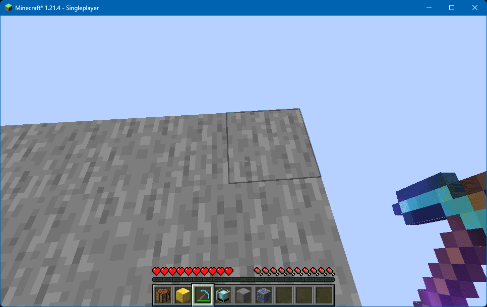

# Item Nudging

**JSST** slightly changes how mined blocks drop their items. They will now always have enough height to be picked up from above (think Skyblocks), and will move towards the player instead of randomly.

<figure><figcaption>
GIF showing items easily being grabbed from above, and from a deep mining hole.
</figcaption></figure>

## Configuration

### Shift Items Upward

Whether mined items will always have enough height to be picked up from above.

* Options: `true`, `false`
* Default: `true`

### Shift Towards Player

Whether mined items will aim towards the player instead of randomly.

* Options: `true`, `false`
* Default: `true`
