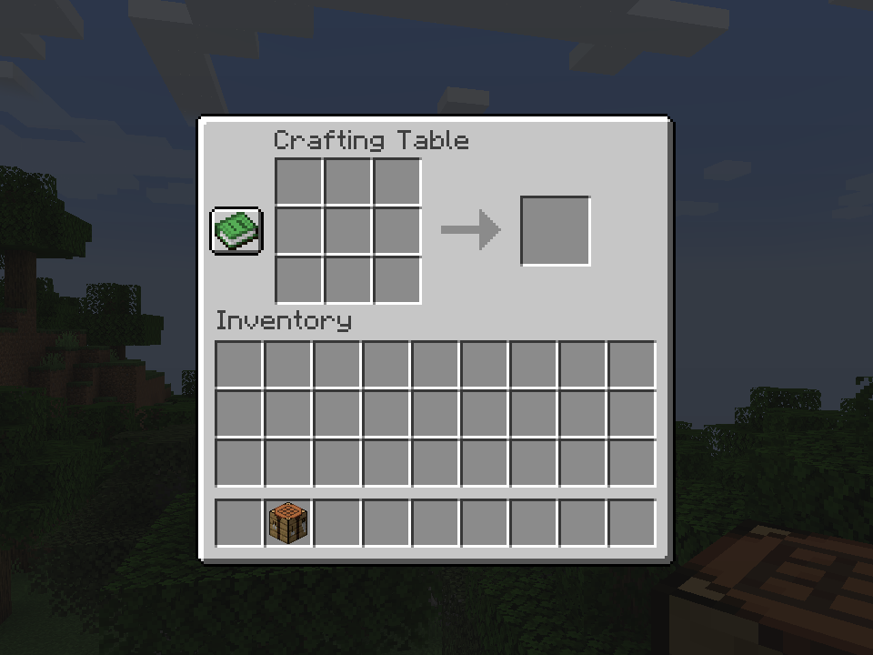

# Portable Crafting

You can now use Crafting Tables from the inventory by right clicking.

<figure><figcaption>
An opened Crafting Table from the inventory.
</figcaption></figure>

## Configuration

### Enabled

Whether this feature should be enabled or not.

* Options: `true`, `false`
* Default: `true`

### Crafting Table ID

Controls what items will open a crafting menu.

* Options: an item ID (`minecraft:crafing_table)` or tag (`#jsst:portable_crafting`)
* Default: `#jsst:portable_crafting`

### Requires Sneaking

Whether players need to sneak in order to open the crafting menu.

* Options: `true`, `false`
* Default: `false`
