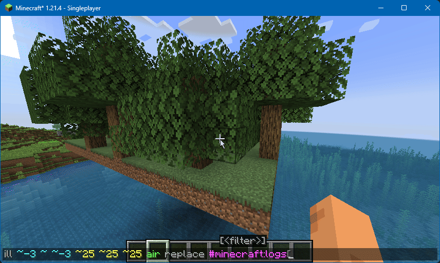

# Sapling Replant

**JSST** will cause decaying saplings try and replant themselves, giving each other space. This allows you to maintain forests easier, or plant your own by 'sprinkling' them about.

<figure><figcaption>
(Exaggerated Settings) Saplings replanting themselves after decay.
</figcaption></figure>

## Configuration

### Enabled

Whether this feature should be enabled or not.

* Options: `true`, `false`
* Default: `true`&#x20;

### Saplings Tag

Item tag that counts as a sapling, which will try to get placed.

* Options: An item tag.
* Default: `minecraft:saplings`

### Search Radius

Radius in blocks that saplings will look for valid ground to plant themselves.

* Options: `[0, 4]`
* Default: `2`

### Search Radius (2x2)

For large saplings, how far they will look for others of their type to connect to.

* Options: `[0, 6]`
* Default: `4`

### Minimum Spacing

How many blocks to aim for between saplings, in order to make a sparser forest.

* Options: `[0, 3]`
* Default: `2`

### Max Saplings per Stack

The maximum amount of saplings allowed to be planted from a single dropped stack of saplings.

* Options: `[1, 16]`
* Default: `4`
